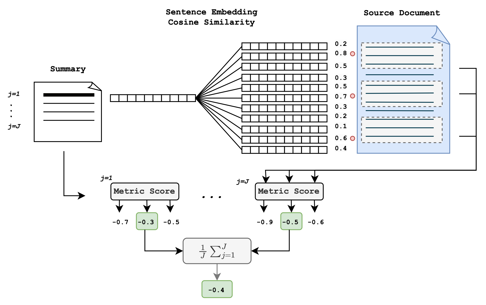

# LongDocFACTScore

This is the repository associated with the paper: [LongDocFACTScore: Evaluating the Factuality of Long Document Abstractive Summarisation](https://aclanthology.org/2024.lrec-main.941/), presented at LREC-COLING 2024 in Turin, Italy. 


### Abstract:

Maintaining factual consistency is a critical issue in abstractive text summarisation, however, it cannot be assessed by traditional automatic metrics used for evaluating text summarisation, such as ROUGE scoring. Recent efforts have been devoted to developing improved metrics for measuring factual consistency using pre-trained language models, but these metrics have restrictive token limits, and are therefore not suitable for evaluating long document text summarisation. Moreover, there is limited research and resources available for evaluating whether existing automatic evaluation metrics are fit for purpose when applied in long document settings. In this work, we evaluate the efficacy of automatic metrics for assessing the factual consistency of long document text summarisation. We create a human-annotated data set for evaluating automatic factuality metrics, LongSciVerify, which contains fine-grained factual consistency annotations for long document summaries from the scientific domain. We also propose a new evaluation framework, LongDocFACTScore, which is suitable for evaluating long document summarisation. This framework allows metrics to be efficiently extended to any length document and outperforms existing state-of-the-art metrics in its ability to correlate with human measures of factuality when used to evaluate long document summarisation data sets.

### Method:

LongDocFACTScore is a reference-free framework which can be applied to any reference-free metric for assessing factual consistency. In this repo, it is implemented with BARTScore. The method uses sentence embeddings to calculate similarity between source document sentences and predicted summary sentences, and then applies metrics to the highest similarity text snippets. The scores per sentence in the predicted summary are averaged to give one score per predicted summary. 

In this work, LongDocFACTScore is implemented with [BARTScore](https://github.com/neulab/BARTScore), and some code is copied from the linked repo. 




### Data sets (including LongSciVerify)

In our work, we curate LongSciVerify data set consisting of PubMed and ArXiv papers with human annotations of factual consistency. More information about the data sets we use can be found [here](./data/README.md)

### Usage of LongDocFACTScore

To run on a piece of text:
```
from longdocfactscore import LDFACTS

predict_summary = "INSERT PREDICTED SUMMARY HERE"
src_doc = "INSERT SOURCE DOCUMENT HERE"

ldfacts_scorer = LDFACTS(device='cpu')

scores = ldfacts_scorer.score_src_hyp_long([src_doc],[predict_summary])
```

To run with some example data:
```bash
pip install -e . 
python run_example.py
```


### Repeat evaluation in LongDocFACTScore paper

#### Set up 

1. Run the following
```bash
pip install -e .
cd evaluation_scripts
git clone https://github.com/ThomasScialom/QuestEval.git
git clone https://github.com/neulab/BARTScore.git
git clone https://github.com/salesforce/factCC.git 
cp ./utils/factcc_run.py ./factCC/modeling/run.py
pip install -r requirements.txt
```
2. Download the factCC trained checkpoint for evaluation and copy into the top level of this repo in a folder called `factcc-checkpoint`
3. Run scripts, dataset options are: `pubmed_longdocfactscore` , `arxiv_longdocfactscore`, `pubmed_longdocfactscore` 

e.g., 

```bash 
cd ..
python evaluation_scripts/run_evaluation.py --dataset pubmed_longdocfactscore
```

